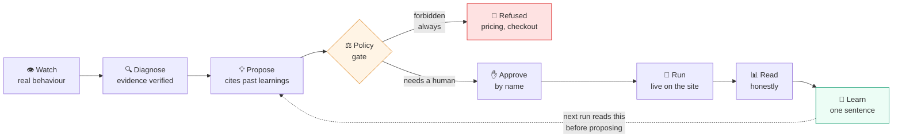
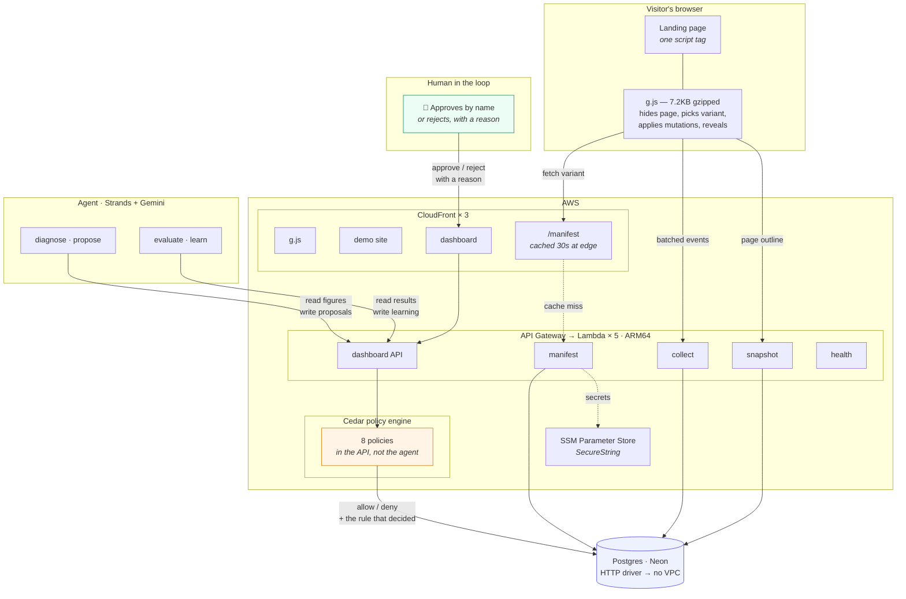
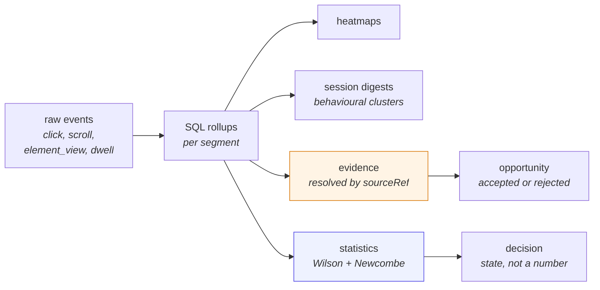

# GrowthX — architecture

Two diagrams. **Diagram 1** is the one to show while introducing the project —
it is the argument, not the infrastructure. **Diagram 2** is the system, for
when someone asks where it runs.

Both render in VS Code (Cmd+Shift+V) and on GitHub. Paste-ready Eraser.io
source is at the bottom of each, and §4 lists every box and arrow label in
plain text so you can redraw them by hand.

---

## 1 · The loop — show this one first

The whole product is one cycle. Every box is a screen in the dashboard, so you
can point at the diagram and then click the thing you just pointed at.



**What to say over it, in one breath:**

> It watches what visitors actually do, finds where conversions leak, and
> proposes a change — citing what previous experiments already proved. It is
> not allowed to launch. A policy engine refuses, a human approves by name, and
> only then does it go live. Then it reads the result honestly and writes down
> one sentence for the next run to read.

**The three beats that stop it being an LLM wrapper** — point at these:

| Box | The claim | How it is proved on screen |
|---|---|---|
| Diagnose | Every cited figure is checked | Six citations were rejected before it quoted correctly |
| Policy gate | It genuinely cannot act freely | Refusals name the exact rule; approval does not unlock pricing |
| Learn | The memory is load-bearing | A proposal was rejected for citing a learning wrongly |

### Eraser.io source

```
// paste into eraser.io
Watch [icon: eye, color: blue]
Diagnose [icon: search, color: blue]
Propose [icon: lightbulb, color: blue]
Policy gate [icon: shield, color: orange, shape: diamond]
Refused [icon: x-circle, color: red]
Approve [icon: user-check, color: green]
Run [icon: rocket, color: green]
Read [icon: bar-chart, color: purple]
Learn [icon: brain, color: green]

Watch > Diagnose: behaviour rolled up in SQL
Diagnose > Propose: verified opportunity
Propose > Policy gate
Policy gate > Refused: forbidden always (pricing, checkout)
Policy gate > Approve: needs a human
Approve > Run: live within 30s
Run > Read: computed, never by the model
Read > Learn
Learn > Propose: next run reads this first
```

---

## 2 · The system — where it runs



### The load-bearing decisions in this diagram

| Decision | Why it is drawn that way |
|---|---|
| `/manifest` on the **CloudFront** box, not the Lambda box | The manifest is per page, never per visitor, so it is edge-cacheable. That takes a cold Lambda off the critical render path — ~30ms instead of ~500ms on a throttled connection |
| Cedar sits **inside the API**, not next to the agent | A gate in the agent's own process is a suggestion. Anything holding the API URL would call the endpoint directly |
| Postgres is **outside** the AWS box | Neon's HTTP driver means the Lambdas need no VPC — no VPC cold starts, no NAT gateway |
| The agent is a **separate box** with arrows only into the dashboard API | It has no database credentials. It reads finished figures and writes through the same gated endpoints a human would |
| The human has an arrow **into** the loop | Not decoration. Nothing reaches a visitor without it |

### Eraser.io source

```
// paste into eraser.io
Visitor's browser [icon: monitor] {
  Landing page [icon: file]
  g.js snippet [icon: code, label: "7.2KB gzipped"]
}

AWS [icon: aws] {
  CloudFront [icon: aws-cloudfront] {
    g.js origin [icon: aws-s3]
    Demo site [icon: aws-s3]
    Dashboard [icon: aws-s3]
    manifest behaviour [icon: zap, label: "cached 30s"]
  }
  API Gateway [icon: aws-api-gateway] {
    manifest [icon: aws-lambda]
    collect [icon: aws-lambda]
    snapshot [icon: aws-lambda]
    dashboard API [icon: aws-lambda]
    health [icon: aws-lambda]
  }
  Cedar policy [icon: shield, color: orange, label: "8 policies, in the API"]
  SSM [icon: aws-systems-manager, label: "SecureString"]
}

Postgres [icon: database, color: blue, label: "Neon · HTTP driver, no VPC"]
Agent [icon: cpu, color: purple, label: "Strands + Gemini"]
Human [icon: user, color: green]

g.js snippet > manifest behaviour: fetch variant
manifest behaviour > manifest: cache miss
g.js snippet > collect: batched events
g.js snippet > snapshot: page outline
Dashboard > dashboard API
dashboard API > Cedar policy: every write
Cedar policy > Postgres: allow/deny + the rule
manifest > Postgres
collect > Postgres
Agent > dashboard API: read figures, write proposals
Human > Dashboard: approve by name
manifest > SSM: secrets
```

---

## 3 · The data path, if anyone asks



**The rule this diagram encodes:** everything in it happens in SQL and
TypeScript. The model reads the output and explains it. It never calculates a
rate, a lift, or a difference between two arms — a statistic a language model
computed is a statistic nobody can check.

---

## 4 · Drawing it by hand

If you are redrawing Diagram 1 in Excalidraw, this is all of it:

**Nine boxes, left to right, one row:**
`Watch` → `Diagnose` → `Propose` → `Policy gate` (diamond) → `Approve` → `Run`
→ `Read` → `Learn`, with `Refused` hanging below the diamond.

**Arrow labels:**

| From → To | Label |
|---|---|
| Watch → Diagnose | behaviour rolled up in SQL |
| Diagnose → Propose | verified opportunity |
| Policy gate → Refused | *forbidden always* — pricing, checkout |
| Policy gate → Approve | *needs a human* |
| Approve → Run | live within 30s |
| Run → Read | computed, never by the model |
| Learn → Propose | **dashed** — next run reads this first |

**Colours:** amber on `Policy gate`, red on `Refused`, green on `Approve` and
`Learn`. Everything else neutral.

**The dashed arrow from `Learn` back to `Propose` is the whole product.** Make
it the most visible line on the diagram — it is the difference between an agent
that generates variants forever and one that accumulates judgement.

---

## 5 · Numbers worth having on the slide

| | |
|---|---|
| Snippet size | 7,255 B gzipped — 89% of an 8KB budget |
| Anti-flicker | No control-to-challenger frame ever painted, measured across 5 throttled loads |
| Mutation gate | 100% of variants applied cleanly after repair, 0 broken layouts in 20 runs |
| Policy | 8 Cedar policies, every refusal traceable to a named rule |
| Lambdas | 5, ARM64, Node 20 |
| Model | Gemini via Strands, 3-model spillover chain |

---

## 6 · What is honestly *not* here

Worth saying yourself before a judge finds it:

- **Bedrock is not used.** Access takes time to come through, the organisers
  said not to wait on it. Gemini through Strands instead — a one-line provider
  change. Strands and Cedar are both AWS open source, so the AWS story does not
  depend on Bedrock.
- **Postgres is Neon, not RDS.** The HTTP driver removes the VPC, and with it
  VPC cold starts and a NAT gateway.
- **The agent runs locally, not on Lambda.** It is a long-running process with
  a model-quota retry loop; containerising it was a rung on the ladder I chose
  not to climb before the deadline.
- **Step Functions is not used.** The experiment lifecycle is in-code. It was
  planned as an upgrade once the in-code path worked, and the clock went first.
