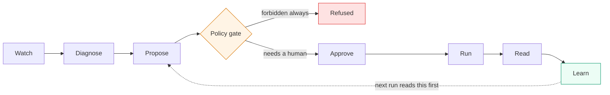

# GrowthX

**An AI growth engineer.** It watches what visitors actually do on a landing
page, finds where conversions leak, proposes a change citing what earlier
experiments proved, gets refused by a policy engine, waits for a human to
approve it by name, runs the test, and reads the result honestly enough to say
*"I don't know yet."*

Built for the WeMakeDevs × AWS hackathon.

```html
<script src="https://<cdn>/g.js" data-site="your_site"></script>
```

One script tag. No repo access, no deploys, no changes to the customer's code.

---

## The idea

Companies are not short of A/B testing tools. They are short of the person who
decides *what to test* — someone who reads the behaviour, forms a hypothesis
worth the traffic, designs the variant, and remembers what the last six
experiments proved.

So this is not a testing tool. It is that person: analyst, designer and
experiment owner collapsed into one agent, with a memory that is load-bearing
rather than decorative.

Three things are visible in the product, because without them it is an LLM
wrapper with a dashboard:

| | What it is | How you can check it, not take my word |
|---|---|---|
| **Learning memory** | Every concluded experiment writes one transferable sentence, retrieved before the next hypothesis | A proposal was rejected for citing a learning by its text instead of its id; the agent re-read the log and corrected itself |
| **Policy gate** | Eight Cedar policies, evaluated in the API before any write | Every refusal names the rule that caused it, on screen. Human approval does **not** unlock pricing |
| **Evidence trail** | Every figure the agent cites is resolved against stored aggregates before an opportunity is accepted | Six citations were rejected in one run before it quoted correctly |

---

## The one rule

**If a computer can calculate it, the model does not get to.**

The agent never computes a conversion rate, a lift, or a difference between two
arms. Every number is calculated in SQL and TypeScript, handed over as finished
text, and the agent's job is to *explain* it. It quotes figures; it never
derives them.

This is not an efficiency choice — it is what makes the evidence trail mean
anything. A statistic a language model calculated is a statistic nobody can
check.

It also paid off in a way I did not expect. When the evaluator kept missing the
most interesting thing in the data, two passes of prompt-tightening did not fix
it. What fixed it was noticing that the thing it was missing — two segments
moving in opposite directions — was arithmetic on numbers I already had. I
computed it and handed it over as a fact.

---

## The loop



The dashed arrow is the whole product — the difference between an agent that
generates variants forever and one that accumulates judgement.

Full diagrams, including where everything runs, are in
[ARCHITECTURE.md](ARCHITECTURE.md).

---

## How it works

**Delivery.** A 7.2KB (gzipped) snippet hides the page, fetches a manifest,
buckets the visitor locally with `fnv1a(visitorId + experimentId) % 100`,
applies mutations, and reveals. Because assignment is client-side, the manifest
is per *page* rather than per visitor — so CloudFront caches it at the edge,
which takes a cold Lambda off the critical render path.

**Anti-flicker is a contract, not a hope.** Reveal timers are registered
*before* the fetch, so a hung API can never leave a page blank, and the snippet
**refuses to mutate after it has revealed** — either the change lands before
anything is visible or it does not land at all. Measured, not asserted: no
control-to-challenger frame is ever painted across five throttled loads.

**Mutations are a closed set** — `replace_text`, `set_style`, `hide`,
`move_before`, `swap` and a few more. There is no `set_html`, ever. Every
selector is resolved against the live page outline before an experiment is
stored, because a variant whose selectors do not resolve applies cleanly and
changes nothing.

**Statistics refuse to overclaim.** Wilson intervals rather than the normal
approximation; Newcombe for the difference. Two rules decide: the interval must
exclude zero, **and** each arm must have reached the size the experiment was
designed for. A 2/50 vs 14/50 split is not called a win despite a tiny p-value,
because early separation is the commonest way an A/B test lies.

---

## Stack

| | |
|---|---|
| Snippet | TypeScript, esbuild, zero runtime dependencies |
| API | Lambda × 5 (Node 20, ARM64), API Gateway HTTP API |
| Policy | [Cedar](https://www.cedarpolicy.com/) via `@cedar-policy/cedar-wasm`, evaluated in-process |
| Agent | [Strands Agents](https://strandsagents.com/) (Python 3.12) + Gemini, 3-model spillover chain |
| Data | Postgres (Neon) + Drizzle |
| Dashboard | React, Vite, Tailwind v4 |
| Infra | AWS CDK — CloudFront × 3, S3, SSM SecureString, CloudWatch |

Two honest notes, since they are the first questions a reviewer asks:

- **Bedrock is not used.** Access takes time to come through and the organisers
  said not to wait on it. Gemini through Strands instead — a one-line provider
  change. Strands and Cedar are both AWS open source, so the AWS story does not
  depend on Bedrock.
- **Postgres is Neon, not RDS.** Its HTTP driver means the Lambdas need no VPC,
  which removes VPC cold starts and a NAT gateway from the architecture.

---

## Running it

Requires Node ≥ 20, pnpm 10, Python 3.12, and an AWS account.

```bash
pnpm install
cp .env.example .env          # fill in AWS, Neon and Gemini values
pnpm run deploy:infra         # builds everything, deploys the CDK stack
```

[GUIDE.md](GUIDE.md) has the full setup, one step at a time, plus a
verification block for every phase.

### The commands that matter

```bash
pnpm e2e                 # the whole story: traffic → diagnose → refuse →
                         # approve → run → conclude → learn
pnpm e2e --check         # is every screen demo-ready? (~10s, changes nothing)

pnpm swarm --sessions 300   # simulated visitors, real browsers, real events
pnpm agent:run              # the agent diagnoses and proposes
pnpm agent:evaluate <id>    # the agent reads a result and writes the learning
```

### Verification

Each of these asserts a property the product claims, and most of them assert a
**refusal** — an allow looks exactly like having no gate at all.

```bash
pnpm check:flicker     # no control-to-challenger frame is ever painted
pnpm check:policy      # pricing edits refused; a forged approval changes nothing
pnpm check:approvals   # nothing reaches a visitor without a human name on it
pnpm check:results     # an underpowered result is not called a win
pnpm check:diff        # the two arms actually render differently
pnpm check:ingestion   # events land, with normalised coordinates
```

---

## The traffic is simulated. The rest is not.

Visitors are simulated personas driving **real browsers** against the
**deployed** site through the **real** snippet, sending **real** events to the
**real** ingestion endpoint. Nothing is ever written to the database directly.
What is simulated is the person, and only the person.

Every such event carries `simulated: true` and its persona, so the dashboard
badges it and nothing downstream can mistake it for human traffic.

The decision each visitor makes lives in [`swarm/behaviour.ts`](swarm/behaviour.ts)
and reads **only page geometry** — never the variant. Grep it for a variant id;
there isn't one. That file is why the numbers mean anything, so read it before
trusting any of them.

---

## Repository

| | |
|---|---|
| [`packages/snippet`](packages/snippet) | `g.js` — delivery, anti-flicker, mutation application, behaviour capture |
| [`packages/api`](packages/api) | Lambda handlers, aggregates, statistics, the policy gate |
| [`packages/agent`](packages/agent) | The Strands agent: diagnose, propose, evaluate |
| [`packages/dashboard`](packages/dashboard) | React dashboard — heatmaps, policy, approvals, results |
| [`packages/shared`](packages/shared) | Mutation schema, validation, the zero-dependency runtime the snippet imports |
| [`policies/growthx.cedar`](policies/growthx.cedar) | What the agent is permitted to do. The authority, not a description of it |
| [`swarm`](swarm) | The traffic simulator |
| [`sites/site-a`](sites/site-a) | A deliberately flawed landing page to run against |
| [`infra`](infra) | AWS CDK |

### Documents

- [PLAN.md](PLAN.md) — the plan of record: phases, data model, design
  decisions, rejected approaches, and where I thought I might be wrong
- [ARCHITECTURE.md](ARCHITECTURE.md) — the diagrams
- [GUIDE.md](GUIDE.md) — setup and per-phase verification
- [DEMO.md](DEMO.md) — the recording runbook
- [ROADMAP.md](ROADMAP.md) — what is left, what was cut and why, and what
  would have to be true before this ran unsupervised

---

## What it found

The experiment it ran — moving the call to action above the supporting copy:

| Arm | Conversion | 95% interval | Sessions |
|---|---|---|---|
| Control | 17.7% | 12.8% – 24.0% | 175 |
| CTA above the copy | 19.3% | 13.6% – 26.6% | 140 |

"Up 1.6 points" would make a better screenshot. But the intervals overlap,
neither arm reached its planned size, and settling a difference that small would
take roughly 9,584 sessions per arm. So it reports **not yet decisive** and
refuses to name a winner.

The interesting part is underneath. Split by device, the segments moved in
**opposite directions** — mobile up 5.3 points, desktop down 5.8. The overall
average hides that completely. Neither row has the traffic to prove it, so it is
a direction to test, not a finding. The agent wrote:

> Moving the hero CTA above the supporting copy appears to help mobile
> conversion while potentially hindering desktop, suggesting that future
> iterations should be targeted by device rather than applied as a global change.

Filed as *inconclusive*, at *low* confidence — derived from the statistics, not
from that sentence. The agent does not get to grade its own work.
